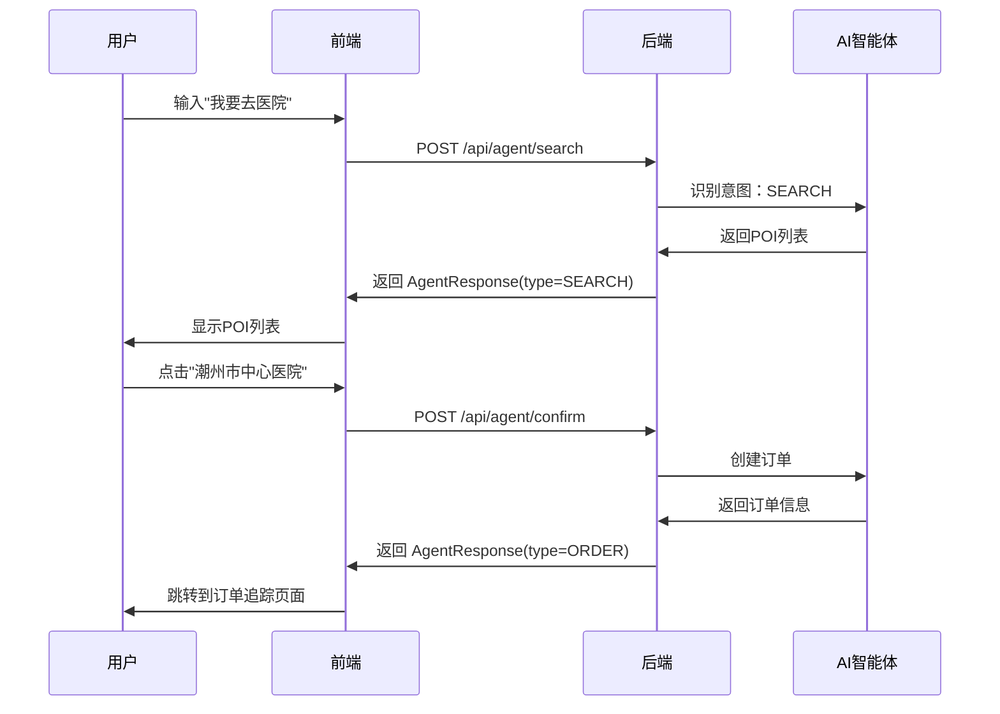
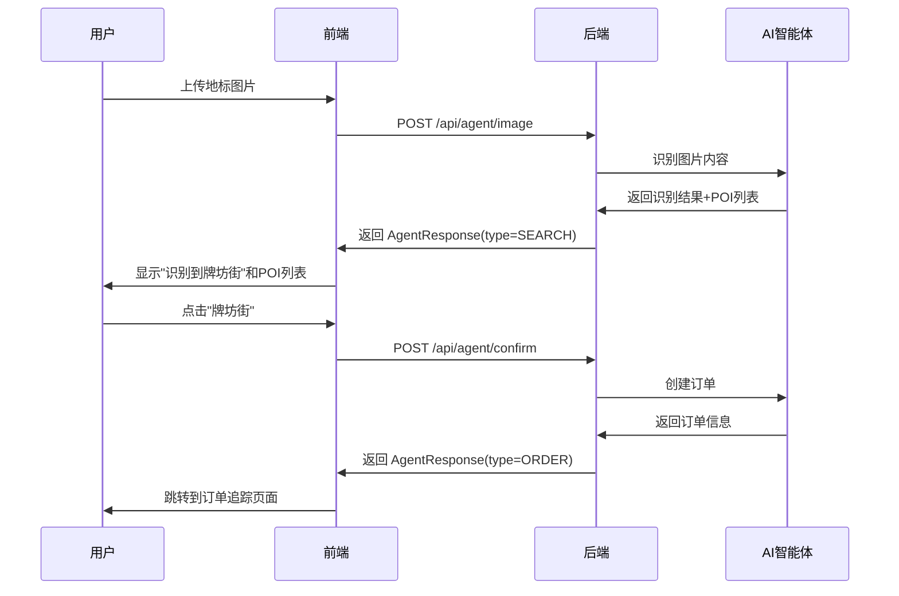

# 智能体AI助手 - 前端API对接文档

## 📋 文档说明

本文档描述了智能体AI助手的所有API接口、字段规范和响应格式。

**基础URL**: `http://your-server:8080/api/agent`

**认证方式**: 所有接口需要在请求头中携带 `X-User-Id`

---

## 🔑 核心概念

### 1. 会话管理（Session）

智能体使用 **sessionId** 来维护对话上下文，前端需要：
- 首次使用时生成唯一 sessionId（建议使用 UUID）
- 同一会话中的所有请求使用相同的 sessionId
- 会话结束时调用清理接口

```kotlin
// 前端示例
val sessionId = UUID.randomUUID().toString()
```

### 2. 智能体状态机

| 状态 | 说明 | 触发条件 |
|------|------|---------|
| INIT | 初始状态 | 新建会话 |
| INTENT_RECOGNIZED | 已识别叫车意图 | 用户输入包含目的地关键词 |
| DEST_PARSED | 已解析目的地（多个候选） | 搜索到多个POI |
| ROUTE_READY | 路线已就绪，等待确认 | 用户选择POI后 |
| WAIT_CONFIRM | 等待用户确认 | 显示确认弹窗 |
| ORDER_CREATED | 订单已创建 | 用户确认后自动下单 |
| IMAGE_RECOGNIZED | 图片识别成功 | 上传图片后 |
| ERROR | 异常状态 | 发生错误 |

---

## 📡 API 接口列表

### 1. 智能搜索接口

**接口地址**: `POST /api/agent/search`

**功能描述**: 根据用户输入的关键词搜索目的地，返回候选POI列表

**请求头**:
```
Content-Type: application/json
X-User-Id: 28
```

**请求体**:
```json
{
  "sessionId": "a1b2c3d4-e5f6-7890-abcd-ef1234567890",
  "keyword": "医院",
  "lat": 23.655706,
  "lng": 116.673630
}
```

**请求参数说明**:

| 参数 | 类型 | 必填 | 说明 |
|------|------|------|------|
| sessionId | String | ✅ | 会话ID（UUID格式） |
| keyword | String | ✅ | 搜索关键词（如：医院、酒店、餐厅） |
| lat | Double | ✅ | 当前纬度 |
| lng | Double | ✅ | 当前经度 |

**响应格式（成功）**:
```json
{
  "code": 200,
  "message": "success",
  "data": {
    "type": "SEARCH",
    "message": "为您找到以下医院",
    "success": true,
    "places": [
      {
        "id": "B000A7BD65",
        "name": "潮州市中心医院",
        "address": "广东省潮州市湘桥区环城西路",
        "lat": 23.661234,
        "lng": 116.645678,
        "distance": 2300,
        "type": "医疗服务",
        "duration": 480,
        "price": 12.5,
        "score": 95.5
      },
      {
        "id": "B000A7BD66",
        "name": "潮州市人民医院",
        "address": "广东省潮州市湘桥区桥东街道",
        "lat": 23.658901,
        "lng": 116.651234,
        "distance": 1800,
        "type": "医疗服务",
        "duration": 360,
        "price": 10.0,
        "score": 88.3
      }
    ]
  }
}
```

**响应字段说明**:

| 字段 | 类型 | 说明 |
|------|------|------|
| type | String | 响应类型：SEARCH / CHAT / ROUTE / ORDER |
| message | String | AI回复消息 |
| success | Boolean | 是否成功 |
| places | Array | POI列表（仅SEARCH类型返回） |
| places[].id | String | POI唯一标识 |
| places[].name | String | POI名称 |
| places[].address | String | POI地址 |
| places[].lat | Double | 纬度 |
| places[].lng | Double | 经度 |
| places[].distance | Double | 距离（米） |
| places[].type | String | POI类型 |
| places[].duration | Integer | 预计耗时（秒） |
| places[].price | Double | 预估价格（元） |
| places[].score | Double | 相关性评分（用于排序） |

**响应格式（失败）**:
```json
{
  "code": 500,
  "message": "搜索失败：网络异常",
  "data": null
}
```

**前端处理逻辑**:
```kotlin
// 1. 显示加载状态
showLoading()

// 2. 调用接口
val response = api.search(sessionId, keyword, lat, lng)

// 3. 处理响应
if (response.code == 200 && response.data?.success == true) {
    val places = response.data.places
    if (places.isNotEmpty()) {
        // 显示POI列表
        showPoiList(places)
    } else {
        // 显示未找到结果
        showMessage("未找到相关地点")
    }
} else {
    // 显示错误
    showError(response.message)
}
```

---

### 2. 确认选择接口

**接口地址**: `POST /api/agent/confirm`

**功能描述**: 用户选择POI后，确认目的地并自动创建订单

**请求头**:
```
Content-Type: application/json
X-User-Id: 28
```

**请求体**:
```json
{
  "sessionId": "a1b2c3d4-e5f6-7890-abcd-ef1234567890",
  "selectedPoiName": "潮州市中心医院",
  "lat": 23.661234,
  "lng": 116.645678
}
```

**请求参数说明**:

| 参数 | 类型 | 必填 | 说明 |
|------|------|------|------|
| sessionId | String | ✅ | 会话ID |
| selectedPoiName | String | ✅ | 用户选择的POI名称 |
| lat | Double | ✅ | POI纬度 |
| lng | Double | ✅ | POI经度 |

**响应格式（成功 - 自动下单）**:
```json
{
  "code": 200,
  "message": "success",
  "data": {
    "type": "ORDER",
    "message": "已确认目的地，正在创建订单",
    "success": true,
    "data": {
      "orderId": 161,
      "orderNo": "AX202604211234567890",
      "userId": 28,
      "startLat": 23.655706,
      "startLng": 116.673630,
      "destLat": 23.661234,
      "destLng": 116.645678,
      "destAddress": "广东省潮州市湘桥区环城西路",
      "status": 2,
      "estimatePrice": 12.50,
      "createTime": "2026-04-21T12:34:56"
    }
  }
}
```

**响应格式（成功 - 仅规划路线）**:
```json
{
  "code": 200,
  "message": "success",
  "data": {
    "type": "ROUTE",
    "message": "路线规划成功",
    "success": true,
    "route": {
      "mode": "driving",
      "duration": 480,
      "distance": 2300,
      "price": 12.5
    }
  }
}
```

**响应格式（失败 - 参数校验）**:
```json
{
  "code": 400,
  "message": "会话已过期",
  "data": null
}
```

**响应格式（失败 - 业务异常）**:
```json
{
  "code": 500,
  "message": "处理失败：订单创建失败",
  "data": null
}
```

**错误码说明**:

| code | 说明 | 处理方式 |
|------|------|---------|
| 400 | 参数校验失败 | 提示用户重新操作 |
| 422 | 识别结果为空 | 提示用户更换图片 |
| 500 | 服务器内部错误 | 提示稍后重试 |
| 503 | 服务暂时不可用 | 提示稍后重试 |

**前端处理逻辑**:
```kotlin
// 1. 显示加载状态
showLoading("正在创建订单...")

// 2. 调用接口
val response = api.confirm(sessionId, poiName, lat, lng)

// 3. 处理响应
when (response.code) {
    200 -> {
        val data = response.data
        when (data?.type) {
            "ORDER" -> {
                // 订单创建成功，跳转到订单追踪页面
                val order = data.data
                navigateToOrderTracking(order.orderId)
            }
            "ROUTE" -> {
                // 显示路线信息
                showRouteInfo(data.route)
            }
        }
    }
    400 -> {
        // 参数错误，提示用户
        showError(response.message)
    }
    500 -> {
        // 服务器错误，提示稍后重试
        showError("订单创建失败，请稍后重试")
    }
}
```

---

### 3. 图片识别接口

**接口地址**: `POST /api/agent/image`

**功能描述**: 上传地标图片，AI识别后自动搜索附近POI

**请求头**:
```
Content-Type: application/json
X-User-Id: 28
```

**请求体**:
```json
{
  "sessionId": "a1b2c3d4-e5f6-7890-abcd-ef1234567890",
  "imageBase64": "data:image/jpeg;base64,/9j/4AAQSkZJRgABAQEAYABgAAD...",
  "lat": 23.655706,
  "lng": 116.673630
}
```

**请求参数说明**:

| 参数 | 类型 | 必填 | 说明 |
|------|------|------|------|
| sessionId | String | ✅ | 会话ID |
| imageBase64 | String | ✅ | Base64编码的图片（含前缀） |
| lat | Double | ✅ | 当前位置纬度 |
| lng | Double | ✅ | 当前位置经度 |

**图片格式要求**:
- 支持格式：JPEG、PNG、WebP
- 最大大小：5MB
- 推荐尺寸：800x600 ~ 1920x1080
- 必须包含前缀：`data:image/jpeg;base64,` 或 `data:image/png;base64,`

**响应格式（成功）**:
```json
{
  "code": 200,
  "message": "success",
  "data": {
    "type": "SEARCH",
    "message": "识别到地标：牌坊街，为您找到以下地点",
    "success": true,
    "places": [
      {
        "id": "B000A7BD70",
        "name": "牌坊街",
        "address": "广东省潮州市湘桥区太平路",
        "lat": 23.662117,
        "lng": 116.649874,
        "distance": 2100,
        "type": "旅游景点",
        "duration": 420,
        "price": 11.0,
        "score": 98.0
      }
    ]
  }
}
```

**响应格式（失败 - 图片格式错误）**:
```json
{
  "code": 400,
  "message": "图片格式不支持，请使用JPEG或PNG格式",
  "data": null
}
```

**响应格式（失败 - 识别失败）**:
```json
{
  "code": 422,
  "message": "未识别到有效地标，请更换图片",
  "data": null
}
```

**响应格式（失败 - API服务异常）**:
```json
{
  "code": 503,
  "message": "图片识别服务暂时不可用，请稍后重试",
  "data": null
}
```

**前端处理逻辑**:
```kotlin
// 1. 压缩图片（如果超过5MB）
val compressedImage = compressImage(imageFile, maxSize = 5 * 1024 * 1024)

// 2. 转换为Base64
val base64 = "data:image/jpeg;base64," + encodeToBase64(compressedImage)

// 3. 调用接口
val response = api.processImage(sessionId, base64, lat, lng)

// 4. 处理响应
if (response.code == 200 && response.data?.success == true) {
    // 显示识别结果和POI列表
    showPoiList(response.data.places)
} else {
    // 显示错误
    showError(response.message)
}
```

---

### 4. 更新用户位置接口

**接口地址**: `POST /api/agent/location`

**功能描述**: 更新用户当前位置（用于后续搜索和路线规划）

**请求头**:
```
Content-Type: application/json
X-User-Id: 28
```

**请求体**:
```json
{
  "sessionId": "a1b2c3d4-e5f6-7890-abcd-ef1234567890",
  "lat": 23.655706,
  "lng": 116.673630
}
```

**请求参数说明**:

| 参数 | 类型 | 必填 | 说明 |
|------|------|------|------|
| sessionId | String | ✅ | 会话ID |
| lat | Double | ✅ | 纬度 |
| lng | Double | ✅ | 经度 |

**响应格式**:
```json
{
  "code": 200,
  "message": "success",
  "data": null
}
```

**前端处理逻辑**:
```kotlin
// 当GPS位置更新时调用
locationManager.onLocationChanged { location ->
    api.updateLocation(sessionId, location.latitude, location.longitude)
}
```

---

### 5. 清理会话接口

**接口地址**: `POST /api/agent/cleanup`

**功能描述**: 清理会话数据，释放服务器资源

**请求头**:
```
Content-Type: application/json
X-User-Id: 28
```

**请求体**:
```json
{
  "sessionId": "a1b2c3d4-e5f6-7890-abcd-ef1234567890"
}
```

**请求参数说明**:

| 参数 | 类型 | 必填 | 说明 |
|------|------|------|------|
| sessionId | String | ✅ | 会话ID |

**响应格式**:
```json
{
  "code": 200,
  "message": "success",
  "data": null
}
```

**前端处理逻辑**:
```kotlin
// 在以下场景调用清理接口：
// 1. 用户退出聊天界面
// 2. 订单创建成功后
// 3. 应用切换到后台

override fun onDestroy() {
    super.onDestroy()
    api.cleanupSession(sessionId)
}
```

---

## 🔄 完整业务流程

### 流程1：文字搜索 → 选择POI → 自动下单



### 流程2：图片识别 → 自动搜索 → 选择POI → 自动下单



---

## 📊 数据结构详解

### AgentResponse（统一响应对象）

```typescript
interface AgentResponse {
  type: "CHAT" | "SEARCH" | "ROUTE" | "ORDER";  // 响应类型
  message: string;                                // AI回复消息
  success: boolean;                               // 是否成功
  places?: PoiDTO[];                              // POI列表（SEARCH类型）
  route?: RouteResult;                            // 路线信息（ROUTE类型）
  data?: any;                                     // 附加数据（ORDER类型为订单对象）
  error?: string;                                 // 错误信息（失败时）
}
```

### PoiDTO（POI信息）

```typescript
interface PoiDTO {
  id: string;          // POI唯一标识
  name: string;        // POI名称
  address: string;     // POI地址
  lat: number;         // 纬度
  lng: number;         // 经度
  distance: number;    // 距离（米）
  type: string;        // POI类型（如：医疗服务、旅游景点）
  duration?: number;   // 预计耗时（秒）
  price?: number;      // 预估价格（元）
  score: number;       // 相关性评分（用于排序）
}
```

### RouteResult（路线信息）

```typescript
interface RouteResult {
  mode: "driving" | "transit" | "walking";  // 出行方式
  duration: number;    // 预计耗时（秒）
  distance: number;    // 距离（米）
  price: number;       // 预估价格（元）
}
```

### OrderInfo（订单信息）

```typescript
interface OrderInfo {
  orderId: number;           // 订单ID
  orderNo: string;           // 订单号
  userId: number;            // 用户ID
  startLat: number;          // 起点纬度
  startLng: number;          // 起点经度
  destLat: number;           // 终点纬度
  destLng: number;           // 终点经度
  destAddress: string;       // 终点地址
  status: number;            // 订单状态
  estimatePrice: number;     // 预估价格
  createTime: string;        // 创建时间
}
```

---

## ⚠️ 注意事项

### 1. SessionId 管理

- ✅ **正确做法**：每次打开聊天界面生成新的 sessionId
- ❌ **错误做法**：全局共用一个 sessionId

```kotlin
// ✅ 正确
class ChatViewModel : ViewModel() {
    private val _sessionId = MutableLiveData<String>()
    val sessionId: LiveData<String> = _sessionId
    
    init {
        // 每次初始化生成新的 sessionId
        _sessionId.value = UUID.randomUUID().toString()
    }
}

// ❌ 错误
object GlobalConfig {
    val sessionId = "fixed-session-id"  // 不要这样做！
}
```

### 2. 错误处理

- 所有接口都需要处理网络异常
- 根据错误码显示不同的提示信息
- 503错误需要提示"服务暂时不可用"

```kotlin
try {
    val response = api.search(sessionId, keyword, lat, lng)
    when (response.code) {
        200 -> handleSuccess(response)
        400 -> showError("参数错误：" + response.message)
        422 -> showError("识别失败：" + response.message)
        503 -> showError("服务暂时不可用，请稍后重试")
        else -> showError("未知错误：" + response.message)
    }
} catch (e: Exception) {
    showError("网络异常，请检查网络连接")
}
```

### 3. 图片上传优化

- 上传前压缩图片（目标大小 < 5MB）
- 限制图片尺寸（推荐 800x600 ~ 1920x1080）
- 显示上传进度

```kotlin
fun uploadImage(imageFile: File) {
    // 1. 检查文件大小
    if (imageFile.length() > 5 * 1024 * 1024) {
        // 压缩图片
        val compressed = compressImage(imageFile, maxSize = 5 * 1024 * 1024)
        processImage(compressed)
    } else {
        processImage(imageFile)
    }
}
```

### 4. 位置更新

- GPS位置变化时及时调用 `/api/agent/location` 更新
- 确保搜索时使用最新的位置

```kotlin
locationManager.onLocationChanged { location ->
    // 更新智能体的位置
    api.updateLocation(sessionId, location.latitude, location.longitude)
    
    // 同时更新UI
    updateCurrentLocation(location)
}
```

---

## 🧪 测试用例

### 测试1：文字搜索

```bash
curl -X POST http://localhost:8080/api/agent/search \
  -H "Content-Type: application/json" \
  -H "X-User-Id: 28" \
  -d '{
    "sessionId": "test-session-001",
    "keyword": "医院",
    "lat": 23.655706,
    "lng": 116.673630
  }'
```

**预期结果**: 返回POI列表，包含医院信息

### 测试2：确认选择

```bash
curl -X POST http://localhost:8080/api/agent/confirm \
  -H "Content-Type: application/json" \
  -H "X-User-Id: 28" \
  -d '{
    "sessionId": "test-session-001",
    "selectedPoiName": "潮州市中心医院",
    "lat": 23.661234,
    "lng": 116.645678
  }'
```

**预期结果**: 创建订单成功，返回订单信息

### 测试3：图片识别

```bash
curl -X POST http://localhost:8080/api/agent/image \
  -H "Content-Type: application/json" \
  -H "X-User-Id: 28" \
  -d '{
    "sessionId": "test-session-002",
    "imageBase64": "data:image/jpeg;base64,/9j/4AAQSkZJRg...",
    "lat": 23.655706,
    "lng": 116.673630
  }'
```

**预期结果**: 识别地标成功，返回POI列表

---

## 📞 联系方式

如有问题，请及时沟通。

---

**文档版本**: v1.0  
**更新时间**: 2026-04-21  
**适用版本**: 后端 v1.0+
